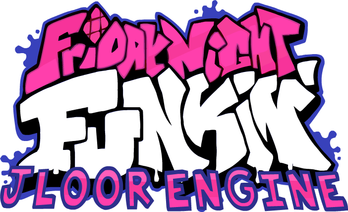

# Friday Night Funkin': Jloor Engine
## Friday Night Funkin'
**Friday Night Funkin'** is a rhythm game originally made for Ludum Dare 47 "Stuck In a Loop".

Links: **[itch.io page](https://ninja-muffin24.itch.io/funkin) ⋅ [Newgrounds](https://www.newgrounds.com/portal/view/770371) ⋅ [source code on GitHub](https://github.com/ninjamuffin99/Funkin)**
> Uh oh! Your tryin to kiss ur hot girlfriend, but her MEAN and EVIL dad is trying to KILL you! He's an ex-rockstar, the only way to get to his heart? The power of music... 

## Jloor Engine
**Jloor Engine** is a engine for Friday Night Funkin': Kade Engine, including a full engine rework, and more.

Links: **[GameBanana engine page](https://gamebanana.com/mods/340421) ⋅ [Discord](https://discord.gg/VseWbHCgRJ)**

**REMEMBER**: This is a **mod**. This is not the vanilla game and should be treated as a **modification**. This is not and probably will never be official, so don't get confused.

# Previews ([skip](#features))

 

# Features

 - **Kade Input System**
	 - An improved input system, similar to Quaver or Etterna, with less delays, less dropped inputs and other improvements.
- **Camera Movement**
	 - Every time you play a note, the camera follows the Player and the Enemy.
- **Note Splashes for Enemy and Player**
	 - Note Splashes.

# Credits
### Friday Night Funkin'
 - [ninjamuffin99](https://twitter.com/ninja_muffin99) - Programming
 - [PhantomArcade3K](https://twitter.com/phantomarcade3k) and [Evilsk8r](https://twitter.com/evilsk8r) - Art
 - [Kawai Sprite](https://twitter.com/kawaisprite) - Music

This game was made with love to Newgrounds and its community. Extra love to Tom Fulp.
### Jloor Engine
- [Jloor](https://twitter.com/GamerJloor) - Owner And Coder
- [Manux](https://twitter.com/ActionsAnimati1) - Secondary Coder
- [ElNelson991](https://twitter.com/elnelson991) - Artist

### Kade Engine
- [KadeDeveloper](https://twitter.com/KadeDeveloper) - Maintainer and lead programmer
- [The contributors](https://github.com/KadeDev/Kade-Engine/graphs/contributors)

### Shoutouts
- [GWebDev](https://github.com/GrowtopiaFli) - Video Code
- [Rozebud](https://github.com/ThatRozebudDude) - Ideas (that I stole)
- [Puyo](https://github.com/daniel11420) - Setting up appveyor and a lot of other help